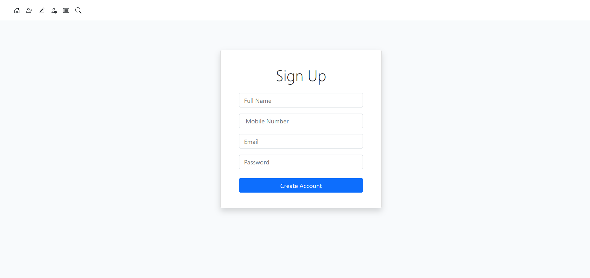
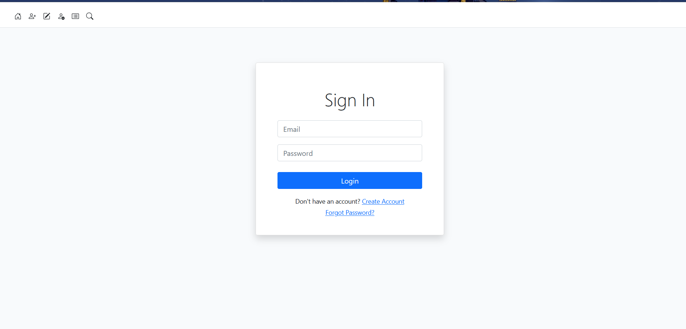
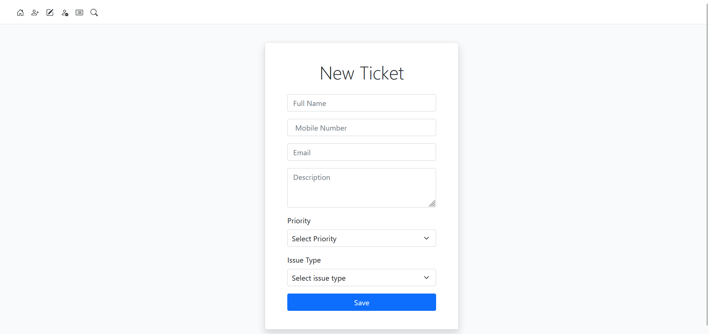
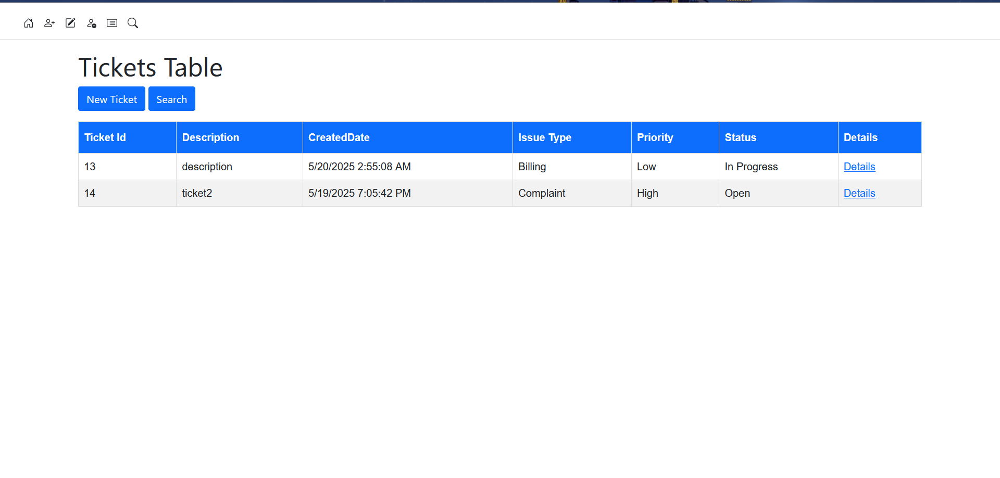
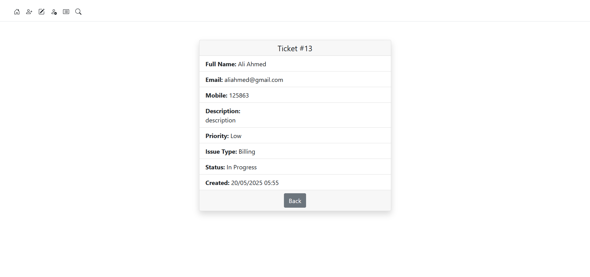
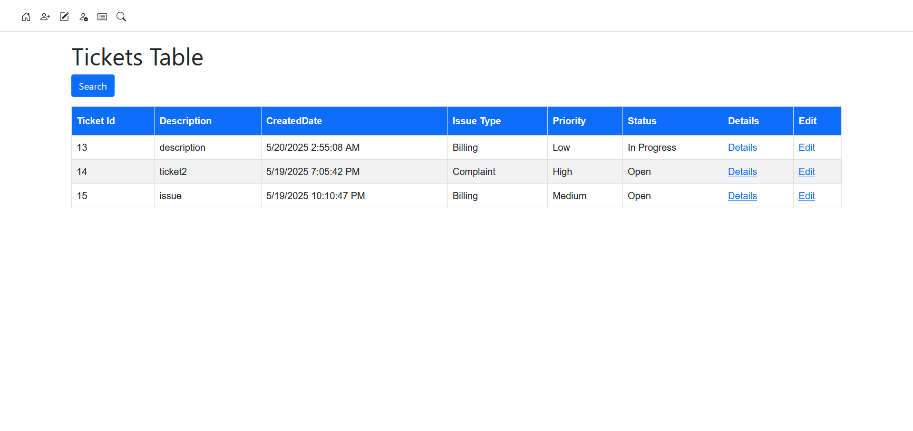
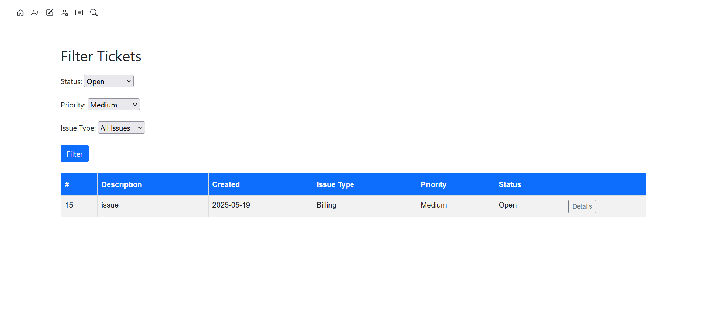
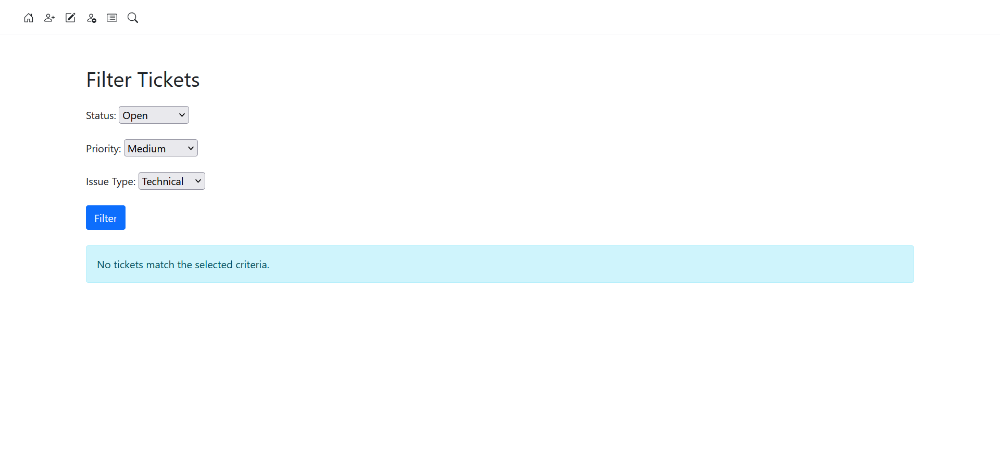
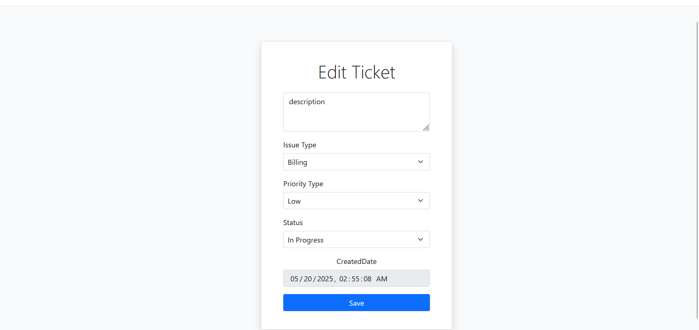

# Ticket Management System – ASP.NET MVC 5

## Objective

This is a pilot technical evaluation task to demonstrate skills in:

- ASP.NET MVC 5  
- SQL Server with stored procedures  
- N-tier architecture  
- Input validation and error handling  

The system provides a functional ticket management module for customers and admins to manage support tickets.

---
##  Admin Login Credentials

To log in as an admin and access ticket management features:

- **Email:** `admin@gmail.com`  
- **Password:** `admin@123`

Make sure to seed these credentials in the database or use them during registration for testing purposes.


## Features
- Login && SignUp
  
  


### Customer

- Create a new ticket with full validation.
- ### Create Ticket Page

- View submitted tickets.
 
- View full ticket details.
 

### Admin

- View all tickets.
  
- Filter tickets by Issue Type and Priority.
 
 
- Edit ticket details (except ID and Created Date).


  

---

## Application Pages

| Page | Access | Description |
|------|--------|-------------|
| Create Ticket | Customer | Submit a new support ticket |
| List Tickets | Customer / Admin | View all submitted tickets |
| View Ticket Details | Customer / Admin | Read-only ticket view |
| Edit Ticket | Admin | Modify ticket info (all fields except ID and date) |
| (Optional) Home Page | Customer / Admin | Navigation to all features |

---

## Architecture Overview

This project uses N-Tier Architecture:

- Presentation Layer (MVC Controllers & Views)  
  Handles routing, UI interaction, and communicates with the BLL.

- Business Logic Layer (BLL)  
  Handles validation, error handling, and business rules.

- Data Access Layer (DAL)  
  Calls SQL stored procedures and returns DTOs.

---

## Database Structure

### Schemas Used

| Schema | Purpose |
|--------|---------|
| Customers_INFO | Customer account data |
| Tickets_Services | Ticket submission data |
| Tickets_order | Lookup values (Priority, Status, Issue Types) |

---

### Tables

#### Tickets_order.PriorityTypes

```sql
CREATE TABLE Tickets_order.PriorityTypes (
    PriorityID INT IDENTITY(1,1) PRIMARY KEY,
    PriorityName VARCHAR(20) NOT NULL
);
```

#### Tickets_order.IssueTypes

```sql
CREATE TABLE Tickets_order.IssueTypes (
    IssueTypeID INT IDENTITY(1,1) PRIMARY KEY,
    IssueTypeName VARCHAR(50) NOT NULL
);
```

#### Tickets_order.StatusTypes

```sql
CREATE TABLE Tickets_order.StatusTypes (
    StatusID INT IDENTITY(1,1) PRIMARY KEY,
    StatusName VARCHAR(30) NOT NULL
);
```

#### Customers_INFO.Customers

```sql
CREATE TABLE Customers_INFO.Customers (
    ID INT IDENTITY(1,1) PRIMARY KEY,
    FullName NVARCHAR(225) NOT NULL,
    MobileNumber VARCHAR(25),
    Email VARCHAR(255) NOT NULL,
    Password NVARCHAR(256) NOT NULL
);
```

#### Tickets_Services.CustomerTickets

```sql
CREATE TABLE Tickets_Services.CustomerTickets (
    TicketID INT PRIMARY KEY IDENTITY(1,1),
    FullName NVARCHAR(225) NOT NULL,
    MobileNumber VARCHAR(25),
    Email VARCHAR(255) NOT NULL,
    Description NVARCHAR(MAX),
    CreatedDate DATETIME2(0) DEFAULT GETUTCDATE() NOT NULL,
    IssueTypeID INT NOT NULL,
    PriorityID INT NOT NULL,
    StatusID INT NOT NULL,
    CustomerID INT NOT NULL,
    CONSTRAINT FK_CustomerTickets_IssueType FOREIGN KEY (IssueTypeID) REFERENCES Tickets_order.IssueTypes(IssueTypeID) ON UPDATE CASCADE,
    CONSTRAINT FK_CustomerTickets_PriorityTypes FOREIGN KEY (PriorityID) REFERENCES Tickets_order.PriorityTypes(PriorityID) ON UPDATE CASCADE,
    CONSTRAINT FK_CustomerTickets_StatusTypes FOREIGN KEY (StatusID) REFERENCES Tickets_order.StatusTypes(StatusID) ON UPDATE CASCADE,
    CONSTRAINT FK_CustomerTickets_Customers FOREIGN KEY (CustomerID) REFERENCES Customers_INFO.Customers(ID) ON UPDATE CASCADE
);
```

---

## Stored Procedures Used

Only stored procedures are used for all operations:

- sp_InsertCustomerTicket
- sp_UpdateCustomerTicket
- sp_GetAllTickets
- sp_GetTicketById
- sp_FilterTicketsByPriorityAndIssue

---

## Validation & Error Handling

- Client-side and Server-side validation using Data Annotations
- All data access wrapped in try-catch blocks
- Friendly error messages returned to UI
- Invalid input prompts error highlights and form restrictions

---

## How to Run the Project

### 1. Prerequisites

- Visual Studio 2019+
- SQL Server Management Studio
- .NET Framework 4.8

### 2. Setup Steps

1. Open `.sln` file in Visual Studio
2. Update `Web.config` connection string
3. Run the included SQL script to:
   - Create schemas, tables
   - Insert lookup data
   - Create stored procedures
4. Build and run the solution
5. Navigate through `/Home`, `/Ticket/Create`, etc.

---

## Notes & Assumptions

- Manual Views (no scaffolding used)
- ViewModels are used for form handling and dropdowns
- Simple login/authorization can be added as an extension
- Password hashing assumed but not implemented in this task

---

## Deliverables

- Visual Studio Solution (zipped)
- SQL script with:
  - Tables and Schemas
  - Stored Procedures
  - Sample seed data
- README file (this one)
